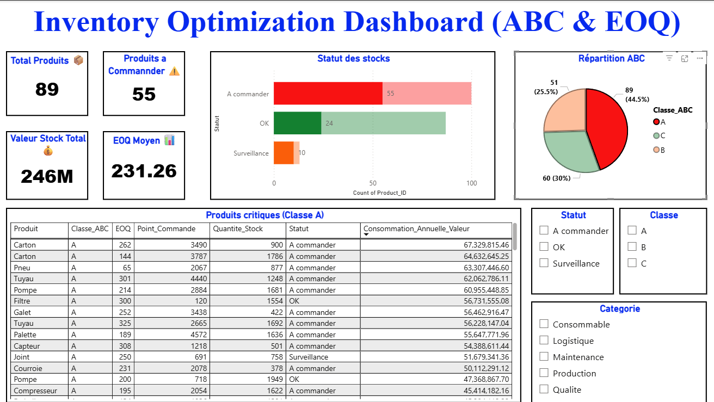
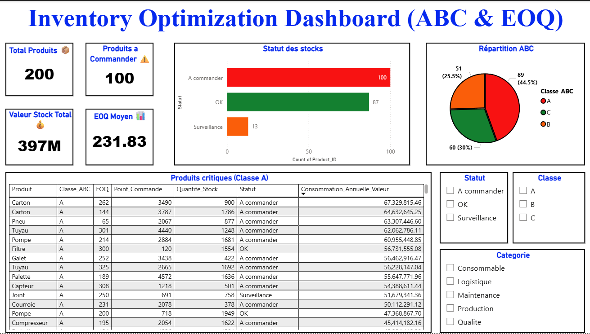
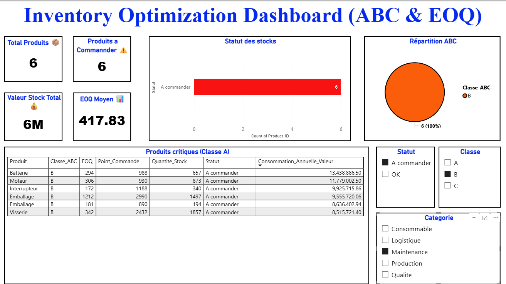
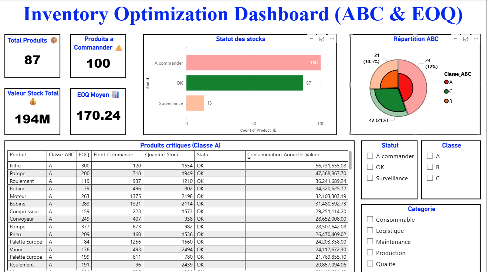

# 📦 Inventory Optimization using ABC Analysis, EOQ & Data Cleaning

## 🎯 Project Overview

This project aims to optimize inventory management by combining data cleaning, ABC classification, and EOQ (Economic Order Quantity) analysis.

The workflow includes:
- Data cleaning using Python (pandas)
- Scalable data processing using PySpark on Databricks
- Inventory optimization using ABC method and EOQ model
- Interactive dashboard creation using Power BI

---

## 🧠 Objectives

- Clean and preprocess raw inventory data
- Identify critical products using ABC analysis
- Optimize order quantities using EOQ
- Detect stock risks using reorder point and status indicators
- Visualize insights for decision-making

---

## ⚙️ Technologies Used

- Python (pandas, numpy)
- PySpark (Databricks)
- Power BI

---

## 📂 Project Structure
📦 project/

├── CoreBusiness/
│   ├── KPI_ABC.py
│   ├── inventory_analysis_final.csv
│   ├── inventory_analysis_final.xlsx
│   └── README.md

├── DataCleaning/
│   ├── data_cleaning_pd.py
│   ├── stock_cleaned.csv
│   └── README.md

├── DataAnalysis/
│   ├── raw_data_pd.py
│   └── README.md

├── Dataset/
│   ├── stock_dataset_dirty_212_rows.csv
│   ├── stock_dataset_dirty_212_rows.xlsx
│   └── README.md

├── Spark/
│   ├── inventory_optimization_pyspark.ipynb
│   └── README.md

├── Dashboard/
│   ├── dashboard.pbix
│   ├── screenshot.png
│   └── README.md

├── README.md
├── LICENSE
└── .gitignore

---

## 🧼 Data Cleaning

The dataset contained:
- Missing values
- Duplicates
- Inconsistent values (negative stock, zero price)

Cleaning steps included:
- Removing unnecessary columns
- Handling duplicates
- Replacing invalid values
- Filling missing data using statistical methods

---

## 📊 ABC Analysis

Products were classified based on annual consumption value:
- A: High importance (top 80%)
- B: Medium importance
- C: Low importance

---

## 📦 EOQ & Inventory Optimization

Key metrics calculated:
- EOQ (optimal order quantity)
- Reorder point
- Safety stock
- Stock status (OK, Surveillance, A commander)

---

## 📈 Dashboard (Power BI)

The dashboard provides:
- KPI indicators (total products, stock value, etc.)
- ABC distribution
- Stock status visualization
- Critical products table

### 📸 Dashboard Preview

---

## 🚀 Key Insights

- A small number of products generate the majority of inventory value (Pareto principle)
- Several products require immediate replenishment
- Data-driven approach improves inventory decision-making

---

## 🔥 Future Improvements

- Integration with real-time data sources
- Automation using Airflow
- Deployment on cloud platforms

---

## 🧠 Author

- Inventory Optimization Project (Data + Supply Chain)
